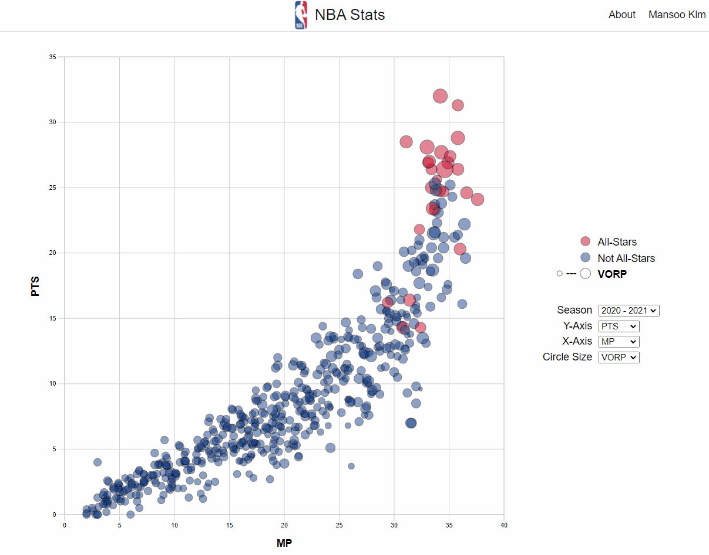
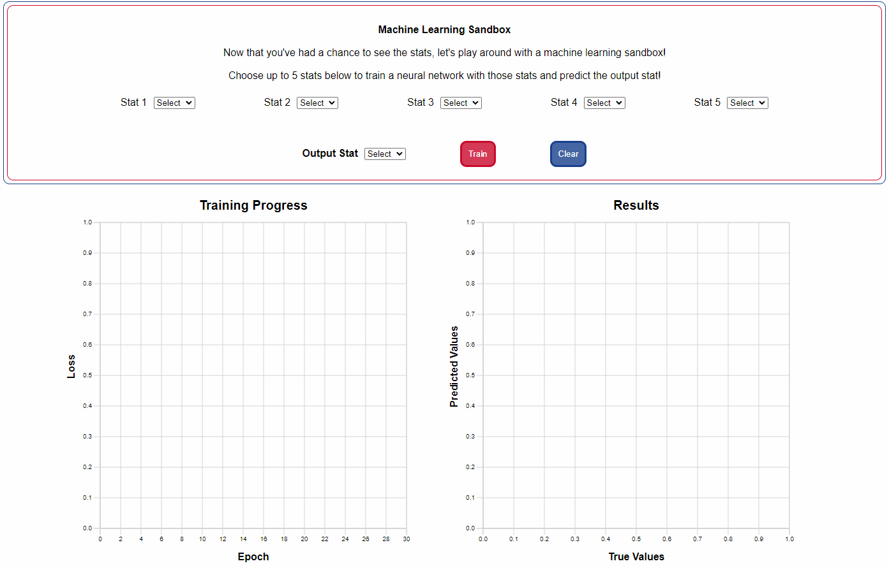

# NBA Stats

[NBA Stats](https://mansookim.github.io/NBA-Stats/) is a data visualization app where users can explore NBA stats from past seasons. Additionally, users can use the machine learning sandbox to train and test a neural network to see how effective certain stats are at predicting an output stat.

## Technologies Used

NBA Stats was implemented using JavaScript, D3.js, and TensorFlow.js

## Key Features

### Visualization Scatter Plot
- Interactive D3.js scatter plot with hover tooltips for more information on stats.
- User selectable stats for Y-axis, X-axis, and circle size.

### Machine Learning Sandbox
- Powered by TensorFlow.js and its neural network implementation.
- Select up to 5 stats to train a neural network model and an output stat to predict.
- Click "Train" to initiate training the model, and wait for the results!

